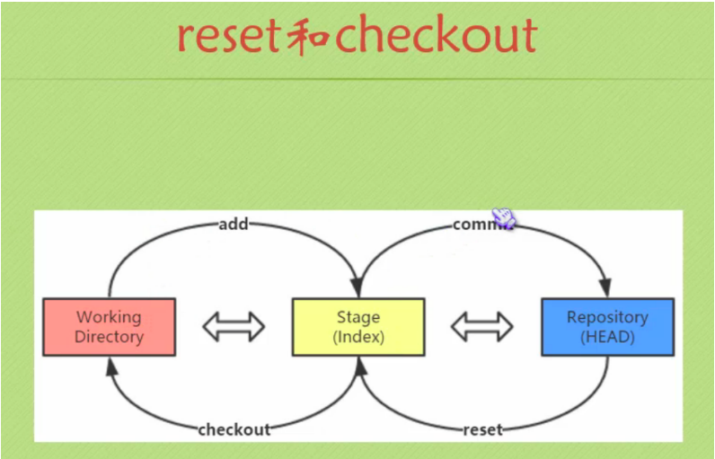
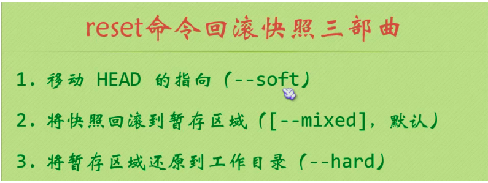
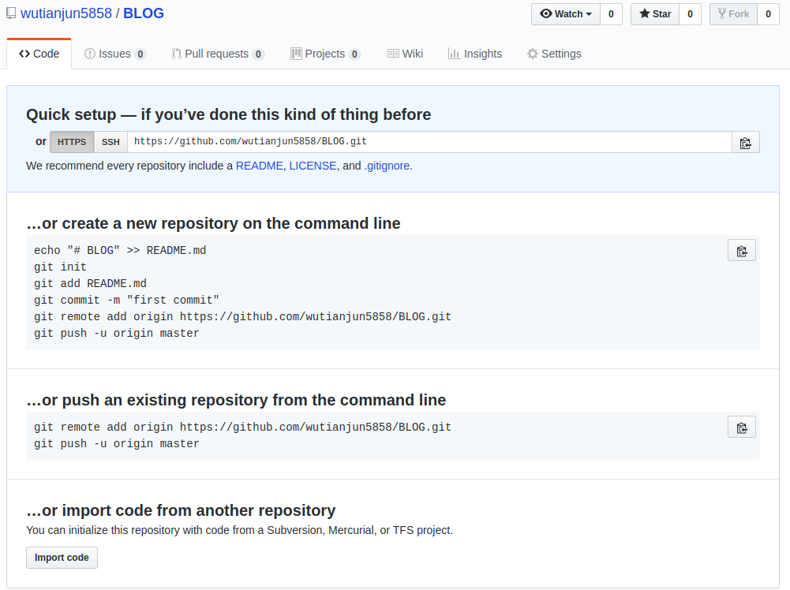

git 使用
===
# git三棵树的关系




# 设置git的输出的编码
- gbk
`git config --global i18n.logoutputencoding gbk`
- utf-8
`git config --global i18n.logoutputencoding utf-8`

# 添加的时候出现CRLF的问题或者LF的问题
- 用`提交检出均不转换`也就是下面的代码
```c
git config --global core.autocrlf false
```

# 建库
```c
git init
```

# 查看和修改git邮件和用户名
- 查看用户名和邮件
```
git config user.name
git config user.email
```
- 修改和配置
```
git config --global user.email "you@example.com"
git config --global user.name "Your Name"
```

# 将工作区提交到暂存区
- 这个是把新添加的以及修改过的都提交
```c
git add .
```
- 这个只提交`修改的`不提交`新添加的`
```c
git add -u
```


## 修改commit的信息

[参考地址](https://git-scm.com/book/zh/v2/Git-%E5%B7%A5%E5%85%B7-%E9%87%8D%E5%86%99%E5%8E%86%E5%8F%B2)

# 将暂存区提交到本地仓库

```
git commit -m "提交的log,方便自己区分"
```

# 恢复到某个版本
```c
git reset --hard 哈希号(只要前面的5个就可以了)
```

# 如果恢复到某个版本错误, 想恢复到原来的
```c
git reflog之后git reset --hard 哈希号(只要前面的5个就可以了), 这就是所谓的时空穿梭
```

# 查看状态(没有提交到暂存区的是红色, 没有提交到本地仓库的是绿色)
```c
git status
```

# 查看log
```c
git log
```

# 撤销工作区的某一个文件的更改(参照暂存区进行修改, 跟暂存区不一致就变成跟暂存区一样的, 甚至没有这个文件也能还原)
```c
git checkout main.c
```

# 撤销工作区的所有的更改
```c
git checkout .
```

# 撤销暂存区的某一个文件的更改(参照本地仓库进行修改, 跟本地仓库不一致就变成跟本地仓库一样)
```c
git reset HEAD(哈希号的前5位) main.c
```

# 查看远程branch
```c
git branch -a
```

# 查看本地branch
```c
git branch
```

# 创建分支并切换到分支test
- 创建分支test
```c
git branch test
```
- 切换到分支test
```c
git checkout test
```
- 切换到分支master
```
git checkout master
```

# 删除本地分支
- 删除本地branch test
```
git branch -d test
```

# 远程仓库的使用
## 查看当前的远程仓库
```c
git remote
```

## 显示克隆地址
```c
git remote -v
```
显示的结果类似:
```c
origin  git://github.com/schacon/ticgit.git (fetch)
origin  git://github.com/schacon/ticgit.git (push)
```
- 如果有多个远程仓库, 此命令将全部列出. 比如在我的Grit项目中, 可以看到
```c
cd grit
git remote -v
```
显示的结果类似
```c
bakkdoor  git://github.com/bakkdoor/grit.git
cho45     git://github.com/cho45/grit.git
defunkt   git://github.com/defunkt/grit.git
koke      git://github.com/koke/grit.git
origin    git@github.com:mojombo/grit.git
```

## 添加远程仓库
```c
git remote add [shortname] [url]
```
- 示例
```c
$ git remote
origin
$ git remote add pb git://github.com/paulboone/ticgit.git
$ git remote -v
origin  git://github.com/schacon/ticgit.git
pb  git://github.com/paulboone/ticgit.git
```

- 示例2




现在可以用字符串`pb`指代对应的仓库地址了. 比如说, `要抓取Paul有的, 但是本地仓库没有的信息`, 可以运行`git fetch pb`

```c
$ git fetch pb
remote: Counting objects: 58, done.
remote: Compressing objects: 100% (41/41), done.
remote: Total 44 (delta 24), reused 1 (delta 0)
Unpacking objects: 100% (44/44), done.
From git://github.com/paulboone/ticgit
 * [new branch]      master     -> pb/master
 * [new branch]      ticgit     -> pb/ticgit
```
现在, Paul的主干分支(master)已经完全可以在本地访问了, 对应的名字是`pb/master`, 我们可以将它合并到自己的某个分支, 或者切换到这个分支了

## 从远程仓库抓取数据
```c
git fetch [remote-name]
```
这个命令会到远程仓库中拉取我们本地仓库中还没有的数据. 运行完成之后, 我们就可以在本地访问该远程仓库中的所有分支, 将其中某个分支合并到本地, 或者只是取出某个分支, 一探究竟. 

如果是克隆了一个仓库, 此命令会自动将远程仓库归于origin名下. 所以, `git fetch origin`会抓取从你上一次克隆以来别人上传到此远程仓库中的所有更新(或是上次fetch以来别人提交的更新), 有一点很重要, `需要记住`, fetch命令只是将远端的数据拉到本地仓库, `并不自动合并到当前分支, 只有当我们确实准备好了, 才能手工合并`.

如果设置了某个分支用于跟踪某个远端仓库的分支, 可以使用`git pull`命令自动抓取数据下来, 然后将远端分支自动合并到本地仓库中当前分支. 在日常工作中, 我们经常这么用, 很快很方便. 实际上, 默认情况下`git clone`命令本质上就是自动创建了本地的master分支用于跟踪远程仓库中的`master`分支(假设远程仓库中确实有master分支). 所以一般我们运行`git pull`, 目的都是要从原始克隆的远端仓库中抓取数据后, 合并到工作目录中的当前分支.

## 推送数据到远程仓库
- 推送当前分支到远程仓库
```c
git push [remote-name] [branch-name]
```
- 推送本地的master分支到`origin`服务器上(再次说明, 克隆操作会自动使默认的master和origin名字)
```c
git push origin master
```
**注意:**只有在所克隆的服务器上有`写权限`, 或者同一时刻没有其他人在推数据, 这条命令才能如期完成. 如果在我们推数据前, 已经有其他人推送了若干更新, 那么我们的推送操作就会被驳回. `我们必须先把他们的更新抓取到本地, 合并到自己的项目中`, 然后才可以再次推送. 

## 查看远程仓库信息
- 命令
```c
git remote show [remote-name]
```
- 示例, 查看克隆的`origin`仓库
```c
$ git remote show origin
* remote origin
  URL: git://github.com/schacon/ticgit.git
  Remote branch merged with 'git pull' while on branch master
    master
  Tracked remote branches
    master
    ticgit
```

## 远程仓库的删除和重命名
### 重命名
```c
git remote rename
```
- 示例, 把`pb`改为`paul`
```c
$ git remote rename pb paul
$ git remote
origin
paul
```

注意, 对远程仓库的重命名, 也会使对应的分支名称发生变化, 原来的`pb/master`分支现在变成了`paul/master`
### 删除
```c
git remote mv
```
- 示例
```c
$ git remote rm paul
$ git remote
origin
```

## 删除远程分支
```c
git branch -r -d origin/branch-name
git push origin :branch-name
```

## 创建远程分支
1. 在本地创建一个本地分支
```c
git branch test_branch
```

2. 将本地的test_branch分支推送到远程仓库, 如果该分支不存在, 则建立相应分支
```c
git push origin test_branch
```

## 直接git clone下来的是只有master分支需要切换到远程分支的操作
1. `git branch -a` 这个查看远程分支, 会看到`remotes/origin/test`(这个是泛指的, 不是具体的)
2. `git checkout -b test remotes/origin/test`,前面的test是在本地新建的, 后面的remotes/origin/test是远端的, 就是把远端的拉到本地, 注意名字要对应, 都是test(泛指)
3. `git checkout test`就可以了

## 拉取远程分支到本地
- `git pull origin test:wtj`(git pull <远程主机名> <远程分支名>:<本地分支名>)

# 标签的使用

[参考地址](https://git-scm.com/book/zh/v1/Git-%E5%9F%BA%E7%A1%80-%E8%BF%9C%E7%A8%8B%E4%BB%93%E5%BA%93%E7%9A%84%E4%BD%BF%E7%94%A8)

# 分支对应的master和当前的master不一样

# 合并分支
## 两种方式
- merge
- rebase

## merge
使用merge可以合并多个历史记录的流程.
- 情况一: 当前的master就是test分支对应的master
直接是使用merge就可以了

- 情况二: 当前的master是对应test分支的master的又有了更新
这种情况下, 要吧master分支的修改内容和bugfix分支的修改内容汇合起来, 因此, 合并两个修改会生成一个提交, 这时, master分支的HEAD会移动到该提交上, 执行合并时, 如果设定了non fast-forward 选项, 即使在能够fast-forward合并的情况下也会生成新的提交并合并,执行Non fast-forward后, 分支会维持原装. 那么要查明这个分支里的操作也很容易

## rebase
- 情况一:当前的master就是test分支对应的master

- 情况二: 当前的master是对应test分支的master的又有了更新


[参考地址](https://backlog.com/git-tutorial/cn/stepup/stepup1_4.html)

# 问题
- you need to resolve your current index first。因为产生了冲突。故需要回退到合并前。(无论是merge还是rebase)
解决方案如下：
  ```c
  git reset --merge
  ```

- Failed to connect to 127.0.0.1 port 8118: Connection refused

  解决方案如下

  ```
  git config --global http.proxy ""
  或者git config --global http.proxy 127.0.0.1:1080, 这个不推荐
  ```


# 待整理的
```c
git 换行符LF与CRLF转换问题
一、背景
在各操作系统下，文本文件所使用的换行符是不一样的。UNIX/Linux 使用的是 0x0A（LF），早期的 Mac OS 使用的是0x0D（CR），后来的 OS X 在更换内核后与 UNIX 保持一致了。但 DOS/Windows 一直使用 0x0D0A（CRLF）作为换行符。Git提供了一个“换行符自动转换”功能。这个功能默认处于“自动模式”，当你在签出文件时，它试图将 UNIX 换行符（LF）替换为 Windows 的换行符（CRLF）；当你在提交文件时，它又试图将 CRLF 替换为 LF。Git 的“换行符自动转换”功能听起来似乎很智能、很贴心，因为它试图一方面保持仓库内文件的一致性（UNIX 风格），一方面又保证本地文件的兼容性（Windows 风格）。但遗憾的是，这个功能是有 bug 的，而且在短期内都不太可能会修正。

二、解决方案
1.Git设置
git config --global core.autocrlf false
git config --global core.safecrlf true
含义：
AutoCRLF
#提交时转换为LF，检出时转换为CRLF
git config --global core.autocrlf true

#提交时转换为LF，检出时不转换
git config --global core.autocrlf input

#提交检出均不转换
git config --global core.autocrlf false
SafeCRLF
#拒绝提交包含混合换行符的文件
git config --global core.safecrlf true

#允许提交包含混合换行符的文件
git config --global core.safecrlf false

#提交包含混合换行符的文件时给出警告
git config --global core.safecrlf warn

2.IDE设置使用UNIX换行符
IDEA的设置File -> Settings
Editor -> Code Style
Line separator (for new lines) ，选择：Unix and OS X (\n)

对已使用Windows换行符的文件，可以使用Sublime Text打开，
View->Line Endings，选Unix，保存；
```

# 待整理2
```
使用github不是很久，把一些遇到的问题记录下来。 
关于git安装以及远程连接仓库相信网上有很多资料 
那些资料都很详细，所以我就不多说了。 
接下来就说说已经连接了远程仓库的情况下，如何将文件夹上传到github。 
很简单的几个命令； 
1：找到你要上传的文件夹，右键点击->选择git-bash-here; 
2：在弹出的命令窗口输入以下命令 
git add . 
我们知道git add命令是用来添加文件到缓存区的，这里使用 . 表示所有。所有这样就把所有的内容添加进去了 
git commit -m “注释” 
这表示提交到分支 
git push origin master 
把当前分支推送到远程仓库 
这样就可以了。 
下面再附上git的相关命令： 
Git基本常用命令如下：

mkdir： XX (创建一个空目录 XX指目录名)

pwd： 显示当前目录的路径。

git init 把当前的目录变成可以管理的git仓库，生成隐藏.git文件。

git add XX 把xx文件添加到暂存区去。

git commit –m “XX” 提交文件 –m 后面的是注释。

git status 查看仓库状态

git diff XX 查看XX文件修改了那些内容

git log 查看历史记录

git reset –hard HEAD^ 或者 git reset –hard HEAD~ 回退到上一个版本

                    (如果想回退到100个版本，使用git reset –hard HEAD~100 )
1
2
cat XX 查看XX文件内容

git reflog 查看历史记录的版本号id

git checkout — XX 把XX文件在工作区的修改全部撤销。

git rm XX 删除XX文件

git remote add origin https://github.com/zongyunqingfeng/testgit 关联一个远程库

git push –u(第一次要用-u 以后不需要) origin master 把当前master分支推送到远程库

git clone https://github.com/zongyunqingfeng/testgit 从远程库中克隆

git checkout –b dev 创建dev分支 并切换到dev分支上

git branch 查看当前所有的分支

git checkout master 切换回master分支

git merge dev 在当前的分支上合并dev分支

git branch –d dev 删除dev分支

git branch name 创建分支

git stash 把当前的工作隐藏起来 等以后恢复现场后继续工作

git stash list 查看所有被隐藏的文件列表

git stash apply 恢复被隐藏的文件，但是内容不删除

git stash drop 删除文件

git stash pop 恢复文件的同时 也删除文件

git remote 查看远程库的信息

git remote –v 查看远程库的详细信息

git push origin master Git会把master分支推送到远程库对应的远程分支上
```

# 忽略文件
vim .gitignore
然后输入需要忽略的文件后缀或者完整的文件
```
*.db文件
```

# git diff
## 工作区 vs 暂存区
```c
git diff <filename>// filename添加了那么就是指定的文件比较
```

也可以查看和另一分支的区别
```c
git diff <branch> <filename>
```

## 暂存区 vs Git仓库
```c
git diff --cached <filename>
```

也快成指定仓库版本:
```c
git diff --cached <commit> <filename> //<commit>可以看git log来获取, 只要前面几个字节
```

## 工作区 vs git仓库
```c
git diff <commit> <filename> // 如果<commit>=HEAD 那么查看工作区和最新commit到仓库的版本内容比较
```

## Git仓库 vs Git仓库
```c
git diff <commit> <commit>// 就是两个指定的commit的版本进行比较
```

## 扩展
以上命令可以不指定`<filename>`, 则对全部文件操作
以上命令涉及和Git仓库对比的, 均可以指定commit的版本
- `HEAD`最近一次commit
- `HEAD^`上一次调教
- `HEAD~100`上100次提交
- 每次提交产生的哈希值
